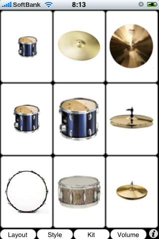
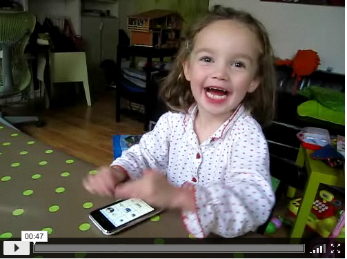

<h1>Drummer</h1>

<h2>What's Drummer ? </h2>

DrummerはiPhoneで動作するドラムアプリケーションです。 
画面上に表示される、キック、スネア、ハイハット、クラッシュシンバル等のアイコンを 指でタッチして、ドラムを演奏できます。

Drummer is Drum Application running on iPhone. 
Drummer is a basic drum machine for your iPhone. It comes with a bass drum, snare, high hat, and cymbal. The app supports multitouch, so you can play all four percussion instruments at the same time, and their sounds will also play at the same time. 

<a href="http://itunes.apple.com/jp/app/drummer-lite/id405274410?mt=8">
Get the App
</a>

<h2>Demo</h2>
https://www.youtube.com/embed/nDh8zmNDucc

<h2>Lesson</h2>

<h3>Lesson 1: Simple Beat</h3>
https://www.youtube.com/embed/nGErOIdpAVY

<h3>Lesson 2: Bounce Beat</h3>
https://www.youtube.com/embed/tDw0bDagTyk

<h3>Lesson 3: Various Beat</h3>
https://www.youtube.com/embed/fUfXSJ7W8Vo

<h2>Users</h2>

<h3>
<a href="http://www.flickr.com/photos/kernelpanic/3031790384/">
Cléo et l'iPhone
</a>
</h3>

<h3>Playing the "Simple Drummer" iPhone app</h3>
https://www.youtube.com/embed/49CPkitzJs4

<h3>iPhone Drummer Freestyle</h3>
https://www.youtube.com/embed/1k0OsFIKWBI

<h3>Simple Drummer: iPhone App</h3>
https://www.youtube.com/embed/To1-J4bqZrY

<h2>Contanct</h2>

We would like to introduce your cool performance!  
Record your performance video, upload to YouTube etc. and tell me!

<a href="mailto:kentaro.matsumae@gmail.com">kentaro.matsumae@gmail.com</a>

</body>
</html>

