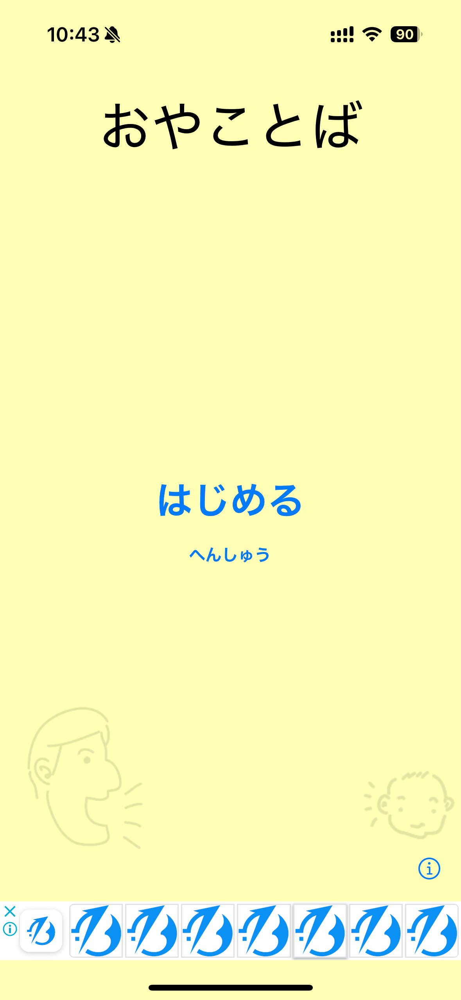
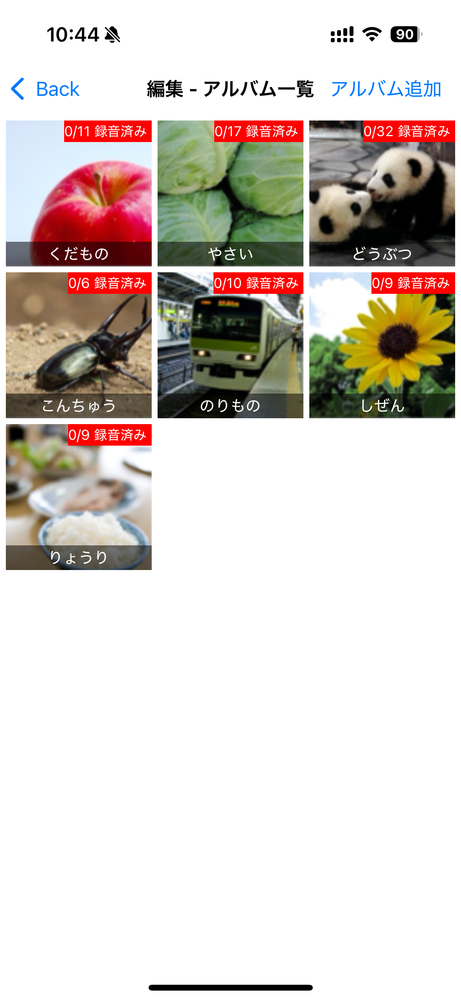
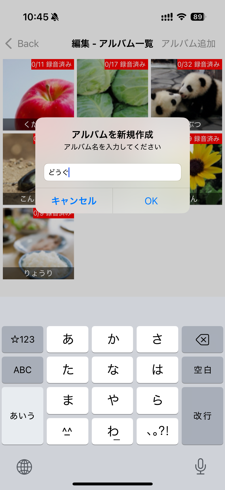
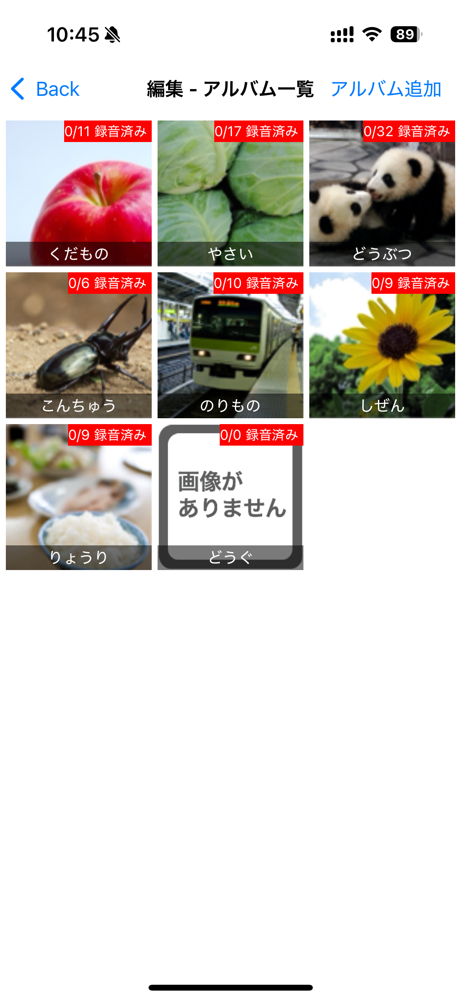
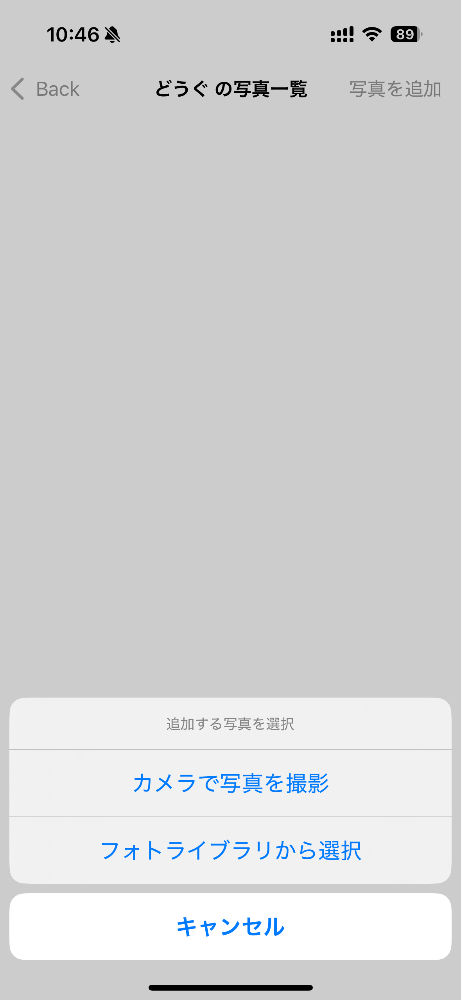
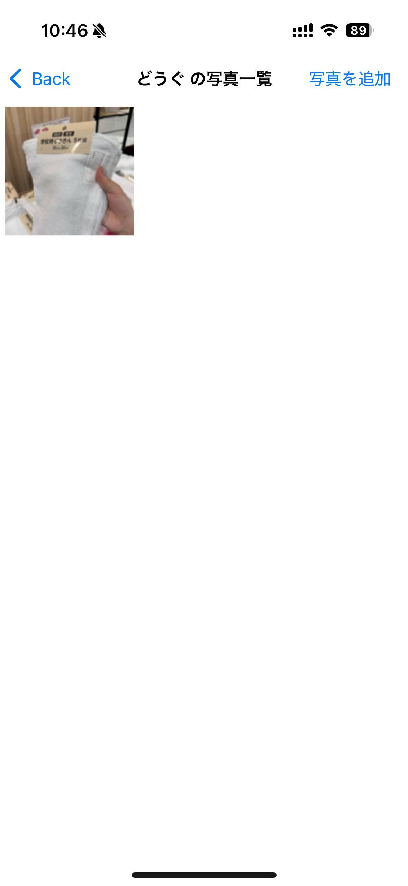
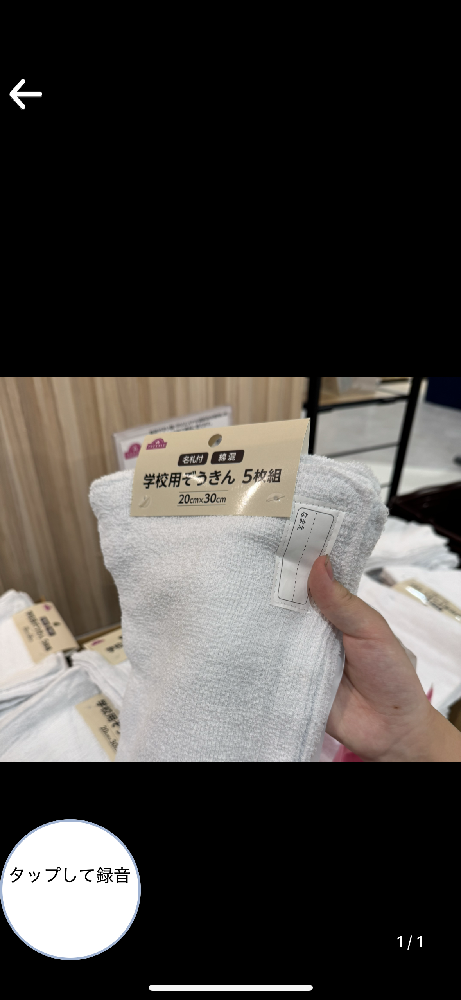
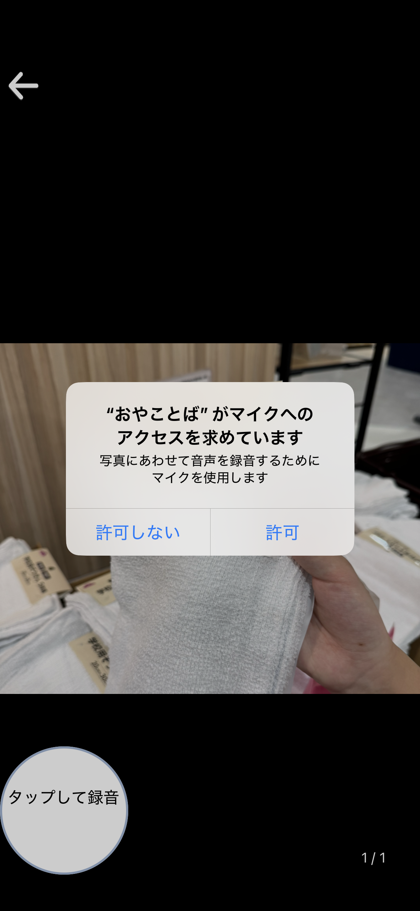
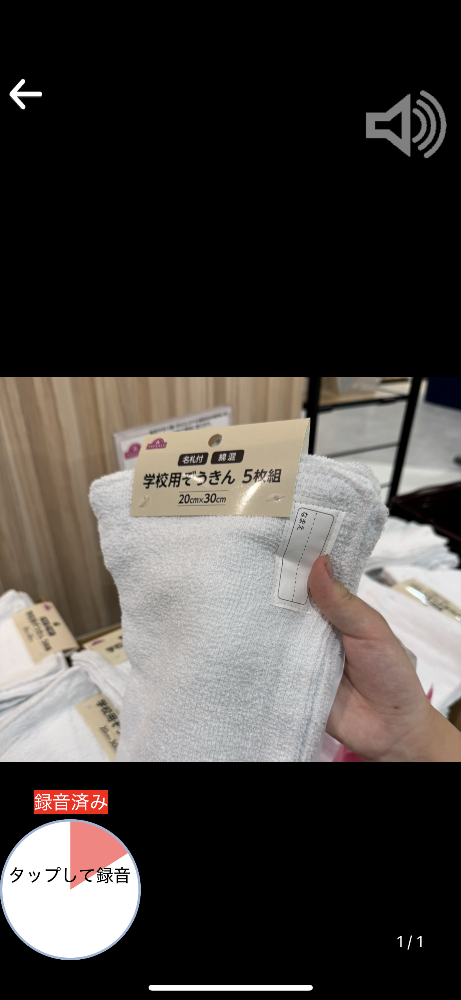

# おやことば

「おやことば」は親子で言葉をたのしく学ぶためのアプリです。

まずパパ・ママは、「録音画面」で写真に対して声を録音します。たとえばサル、ライオン、リンゴ、でんしゃ、など子どもに語りかけるように録音しておきます。

次に子どもにアプリを使わせます。アプリをはじめると、画面上に次々に写真が表示されます。写真をタップすると、先ほどパパ・ママが吹き込んだ声が再生されます。写真にあわせてパパやママの声が再生されるので、こどもはたのしい気持ちで言葉を学ぶことができます。

たとえばパパがお仕事で忙しい場合は、パパにあらかじめ声を吹きこんでおくことで、パパが仕事で忙しい時でもこどもはパパの声を聞くことができ、親子との絆もきっと深まることでしょう。

また、<a href="#my_album">自分で写真を追加することも可能</a>なので、たとえば家族の顔写真をとりこんで、パパやママ、おじいちゃん、おばあちゃんなどの顔と声を組み合わせて子どもに聞かせることもでき

<h2 id="my_album">アルバムを作成して写真を追加する</h2>

以下の手順で独自のアルバムを作成して、写真を追加できます
 
<ol>
<li>アプリを起動して「へんしゅう」ボタンを押します</li>

<li>右上の「アルバムを追加」ボタンを押します</li>

<li>アルバム名を入力して「OK」ボタンを押します</li>

<li>アルバム一覧画面に空のアルバムが追加されるので、タップします</li>

<li>右上の「写真を追加」ボタンをタップします</li>

<li>フォトライブラリから画像を選択するか、カメラで画像を撮影します。</li>

<li>写真が追加されました</li>

<li>追加された写真をタップすると写真を確認できます</li>

<li>左下の「タップして録音」ボタンを押して録音を開始します。初回のみマイクへのアクセス許可が求められるので許可します。</li>

<li>画面をタップすることで録音した声を確認できます</li>

